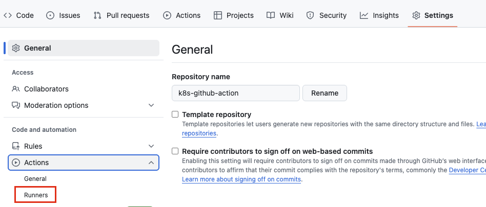
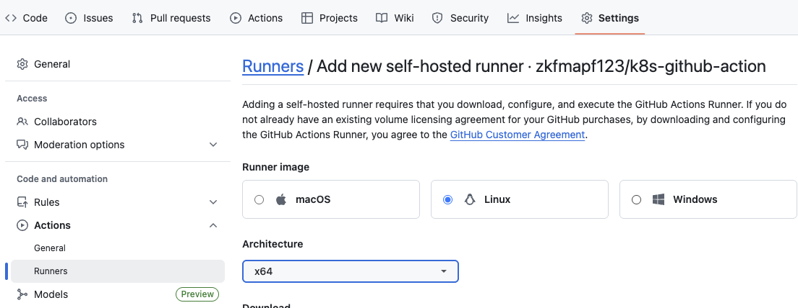
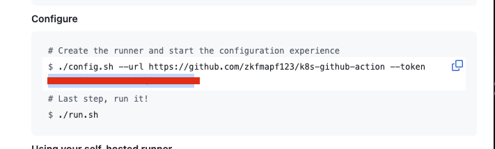
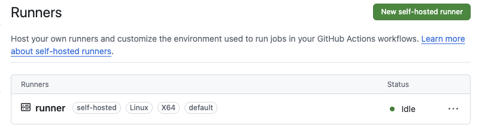
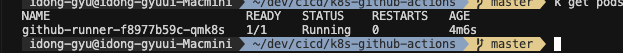

# K8S Github Action Runners

## Environments

- EKS
- Node Spec (t3.small)
    - 2 CPU
    - 2 MEM
- Karpenter

## Namespace / Secret 생성

```sh
kubectl create namespace action

kubectl create secret generic github-runner-secret \
  --namespace action \
  --from-literal=token=YOUR_GITHUB_TOKEN
```

## Karpetner 설정

- ttlSecondsAfterEmpty: 30 ## 인스턴스가 비워지면 30초후 삭제

## 설정방법 (Action Runner)






- Secret에 토큰 저장하기




