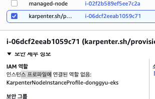

# K8S Github Action Runners

## ...

- [x] Github Action use K8S
- [ ] 요청 시 Action Pod / Node Scale-out
- [ ] Github Action 병렬처리
    - [ ] Karpenter 깊게 이해하기
    - [ ] Github Action 요청이 많을때 자체적으로 Action 이 늘어날순없을까? ( Action : Pod = 1: 1 )
    - [ ] Action Deployment를 Replica를 늘리면 Karpenter가 자체적으로 늘어나게 할 수 있을까?

## Environments

- EKS
- Node Spec (t3.small)
    - 2 CPU
    - 2 MEM
- Karpenter

## Namespace / Secret 생성

```sh
kubectl create namespace action

kubectl create secret generic github-runner-secret \
  --namespace action \
  --from-literal=token=YOUR_GITHUB_TOKEN
```

## Karpetner 설정

- ttlSecondsAfterEmpty: 30 ## 인스턴스가 비워지면 30초후 삭제

## 설정방법 (Action Runner)


- Secret에 토큰 저장하기


## Trouble Shooting...

### EC2 Node Issue

- Node Status가 NotReady
- EC2 Instance Profile이 없어서 -> Kubelet이 EKS Control Plane에 접근 불가
- <b>InstanceProfile을 직접 지정</b>




```sh

## karpenter log 분석
kubectl -n karpenter logs deployment/karpenter

## karpenter.yaml
provider:
    instanceProfile: eks-karpenter-action-instance-profile
```

### EC2 NodePool 없음 (진행 중)

- 6개의 노드가 실패 후 -> karpenter가 nodeclaim을 기준으로 노드를 생성하려고 시도

```sh
  Warning  FailedScheduling  14s   default-scheduler  0/6 nodes are available: 6 Insufficient cpu. preemption: 0/6 nodes are available: 6 No preemption victims found for incoming pod.
  Normal   Nominated         13s   karpenter          Pod should schedule on: nodeclaim/default-tn8fg
```

- k describe nodeclaims.karpenter.sh <node-claim>


- nodeClaim 에 구성된 노드가 EKS 클러스터에 <b>join</b> 되지 않았음 (Node not registerd with cluster)
- nodeClaim으로 구성된 Ec2에 들어가서 보면 아래와 같은 에러가 발생하고 있음
```sh
 1498 csi_plugin.go:887] Failed to contact API server when waiting for CSINode publishing: Unauthorized
```


